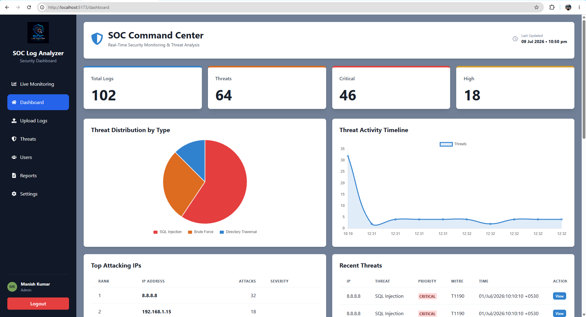
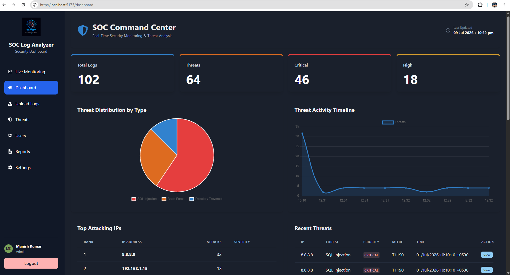
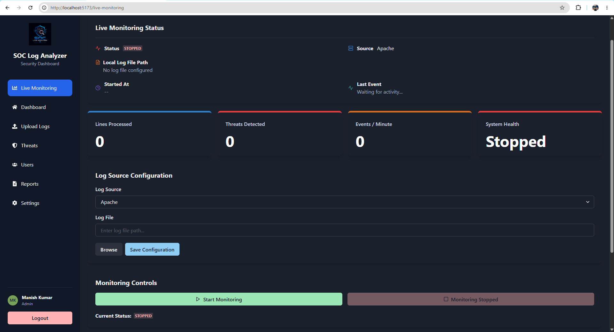
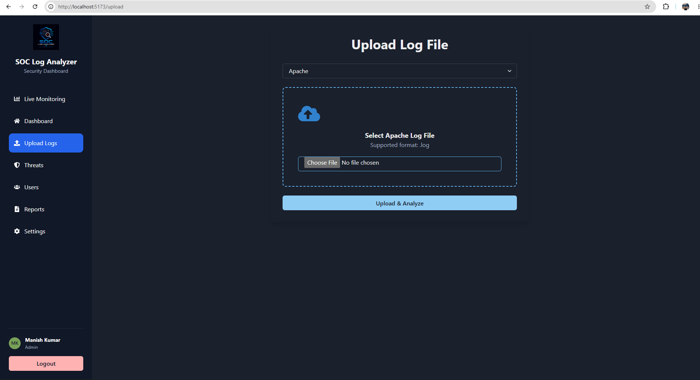
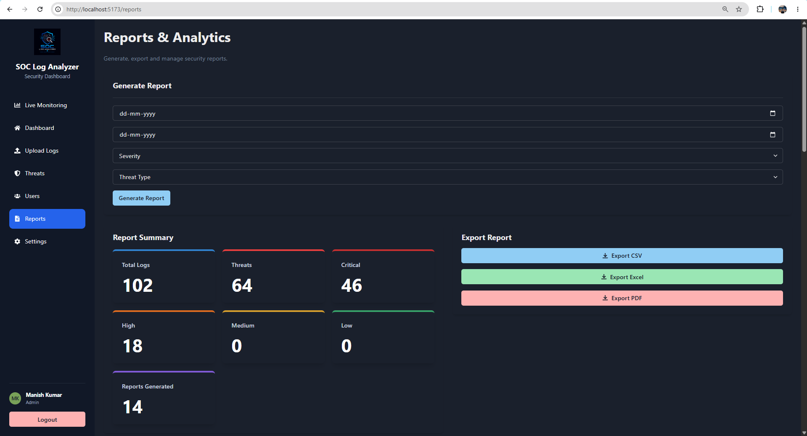

# 🛡️ SOC Log Analyzer

A full-stack Security Operations Center (SOC) Log Analyzer that detects suspicious activities from Apache, Linux, and Windows logs, provides real-time monitoring, interactive dashboards, threat visualization, and automated email alerts.

---

## 📌 Overview

SOC Log Analyzer is designed to help Security Analysts monitor, analyze, and investigate security events efficiently.

The application supports multiple log sources, automatically detects common attack patterns, visualizes threats using charts and maps, and generates professional security reports.

---

## ✨ Features

### 🔐 Authentication

- User Registration
- Secure Login
- JWT Authentication
- Password Encryption (bcrypt)
- Forgot Password (OTP via Email)
- Reset Password
- Change Password

---

### 📂 Log Analysis

- Upload Apache Logs
- Upload Linux Logs
- Upload Windows Logs
- Automatic Log Parsing
- Threat Detection
- Severity Classification

---

### 🚨 Threat Detection

Detects:

- Failed Login Attempts
- Brute Force Attacks
- SQL Injection
- Directory Traversal
- Suspicious IP Activity
- Multiple Login Attempts

---

### 📊 Dashboard

- Total Logs
- Total Threats
- Critical Threats
- High Severity Threats

Interactive Visualizations:

- Threat Distribution Chart
- Threat Timeline
- Top Attacking IPs
- Recent Threats
- World Threat Map
- Attack Origin Analysis
- System Health Widget
- Live Monitoring Status

---

### 🌍 Threat Visualization

- Interactive World Map
- Attack Origin Tracking
- Country-wise Threat Analysis

---

### ⚡ Live Monitoring

- Real-time Log Monitoring
- Socket.IO Updates
- Activity Feed
- Monitoring Statistics
- Configurable Log Sources

> **Note:** Live Monitoring is intended for environments where the application has access to the monitored log files. When deployed to a cloud platform, local file monitoring is not available without a log shipping mechanism.

---

### 📧 Email Alerts

- Critical Threat Alerts
- High Severity Alerts
- Configurable Alert Email
- Test Email Functionality
- SMTP Integration

---

### 📑 Reports

Generate:

- PDF Reports
- Excel Reports

---

### ⚙️ Settings

- Dark / Light Theme
- Email Alert Configuration
- Password Management
- Account Information

---

## 🛠️ Tech Stack

### Frontend

- React.js
- Vite
- Chakra UI
- React Router
- Chart.js
- Socket.IO Client

### Backend

- Node.js
- Express.js
- MongoDB Atlas
- Mongoose
- JWT
- bcrypt
- Nodemailer
- Multer
- Socket.IO

### Security

- JWT Authentication
- Password Hashing
- Protected APIs
- OTP Verification

---

## 📂 Supported Log Sources

| Source | Status |
|---------|--------|
| Apache | ✅ |
| Linux | ✅ |
| Windows | ✅ |

---

## 🛡️ Supported Threat Types

- SQL Injection
- Directory Traversal
- Failed Login
- Brute Force
- Suspicious IP
- Multiple Login Attempts

---

## 📷 Screenshots

### Dashboard (Light Mode)

> 

---

### Dashboard (Dark Mode)

> 

---

### Live Monitoring

> 

---

### Upload Logs

> 

---

### Reports

> 

---

## 🚀 Installation

### Clone Repository

```bash
git clone https://github.com/M-Kay7634/SOC-Log-Analyzer
```

---

### Backend

```bash
cd backend
npm install
npm run dev
```

---

### Frontend

```bash
cd frontend
npm install
npm run dev
```

---

## ⚙️ Environment Variables

### Backend

```env
PORT=5000

MONGO_URI=YOUR_MONGODB_URI

JWT_SECRET=YOUR_SECRET

CLIENT_URL=http://localhost:5173

EMAIL_USER=YOUR_EMAIL

EMAIL_PASS=YOUR_APP_PASSWORD

EMAIL_HOST=smtp.gmail.com

EMAIL_PORT=587
```

---

### Frontend

```env
VITE_API_URL=http://localhost:5000/api
```

---

## 📊 Project Architecture

```text
                React + Vite
                     │
                     │ REST API
                     ▼
            Node.js + Express
                     │
      ┌──────────────┼───────────────┐
      │              │               │
 MongoDB        Socket.IO      Nodemailer
      │              │               │
      ▼              ▼               ▼
 Dashboard     Live Monitoring    Email Alerts
```

---

## 📌 Future Improvements

- Role-Based Access Control (RBAC)
- MITRE ATT&CK Mapping
- SIEM Integration
- ElasticSearch Support
- Splunk Integration
- Threat Intelligence APIs
- Docker Deployment
- Kubernetes Support

---

## 📜 License

This project is created for educational and cybersecurity research purposes.

---

## 👨‍💻 Author

**Manish Kumar**

B.Tech Cyber Security Engineering

Lloyd Institute of Engineering and Technology

GitHub: https://github.com/M-Kay7634

LinkedIn: www.linkedin.com/in/mmanish7634

---

## ⭐ Support

If you found this project useful, consider giving it a ⭐ on GitHub.